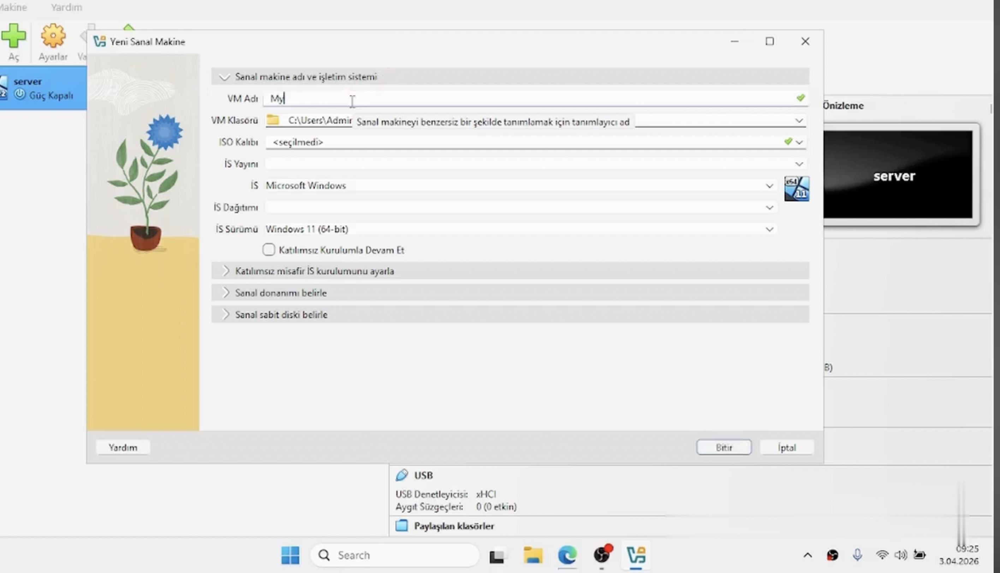

# Windows Server 2025 Setup (VirtualBox)

## 🎥 Video
https://youtu.be/6012olsa_6g

---

## 🇬🇧 English

### Objective
Set up a Windows Server 2025 virtual machine using VirtualBox.

### Environment
- VirtualBox
- Windows Server 2025 ISO
- Local machine

### Steps
1. Download and install VirtualBox
2. Create a new virtual machine
3. Allocate RAM and CPU
4. Attach Windows Server ISO
5. Start installation process
6. Configure initial settings

### Screenshots

### What I Learned
- Virtual machine setup basics
- Server installation workflow
- Resource allocation considerations

---

## 🇹🇷 Türkçe

### Amaç
VirtualBox kullanarak Windows Server 2025 sanal makine kurulumu yapmak.

### Ortam
- VirtualBox
- Windows Server 2025 ISO
- Yerel bilgisayar

### Adımlar
1. VirtualBox kurulumu
2. Yeni sanal makine oluşturma
3. RAM ve CPU ayarlama
4. ISO bağlama
5. Kurulumu başlatma
6. İlk yapılandırma

### Ekran Görüntüleri
(Ekran görüntülerini buraya ekle)

### Öğrendiklerim
- Sanal makine kurulumu
- Server kurulum süreci
- Kaynak yönetimi