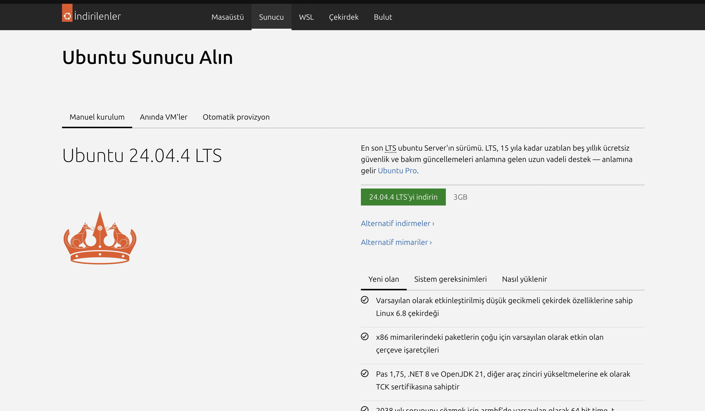
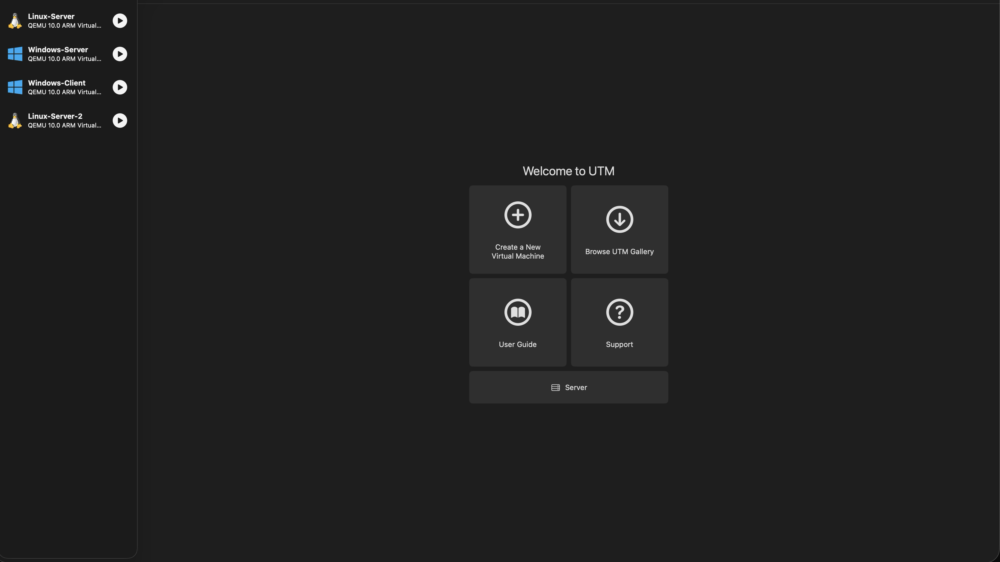
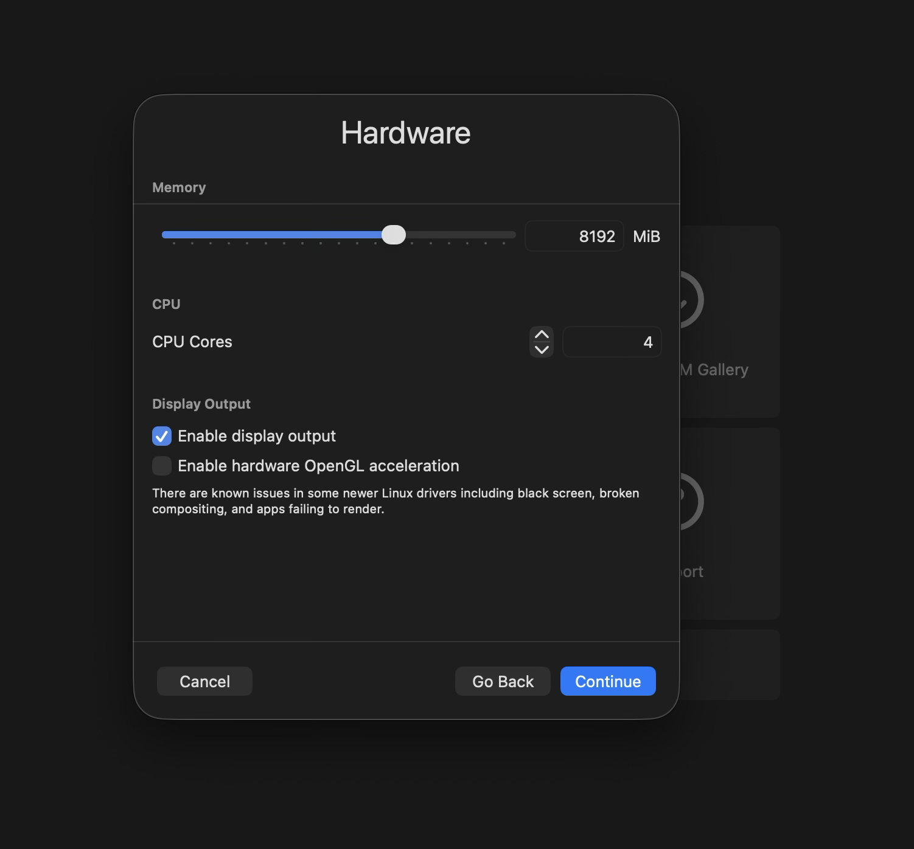

# 01 - Ubuntu Server Kurulumu (UTM ile GUI'sız)

Bu bölümde Ubuntu Server’ı UTM üzerinde GUI’sız olarak kurma sürecini adım adım anlatıyorum.  
- ISO indirme  
- UTM ile sanal makine kurulumu  
- Kaynak ayarlaması (CPU, RAM, disk)  

---

##Youtube Video'lu Anlatım İçin Tıklayınız
https://www.youtube.com/watch?v=_qQ3CdMgU84

## 1. ISO Nasıl İndirilir?

1. Resmî Ubuntu Server sayfasına girin:  
   https://ubuntu.com/download/server  
2. LTS versiyonunu seçip `.iso` dosyasını indirin.  

---

## 2. UTM ile Sanal Makine Kurulumu

1. UTM’yi açın ve yeni bir makine oluşturun.  
2. “Virtualize Ubuntu Server” seçeneğini kullanın.  

---

## 3. Kaynak Ayarlamaları

CPU, RAM ve disk ayarlarını ihtiyacınıza göre belirleyin:
Daha düşük seçeneklerle de ilerlenebilir, ancak performans düşebilir.

- CPU: 4 vCPU  
- RAM: 6-8 GB  
- Disk: 64 GB (dynamically allocated)  

